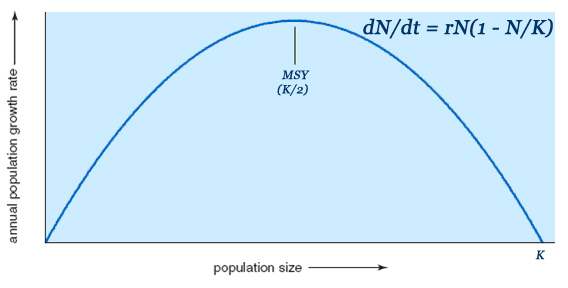

```{r setup, include=FALSE}
options(htmltools.dir.version = FALSE)
```

<!--
background-size: contain;      /* applied using JavaScript only if background-image is larger than slide */
-->


background-image: url(img/noaa_fisheries.jpg)
background-position: center
background-size: 180%
class: center, bottom, inverse

> The real goal of fisheries management is to avoid finding out what the stock-recruitment relationship is. Once you have depleted the stock enough to know, it’s probably too late

--John Shepard, from an argument with David Cushing, ca 1980

---

# How do we manage what we cannot measure?

---

# Classic MSY



$$\frac{dN}{dt} = \underbrace{r N \left(1 - \frac{N}{K} \right)}_{f(N)} - H$$
$$H_{\text{MSY}} = f(N) = r K / 4$$
$$B_{\text{MSY}} = K/2 $$


---

# Stochastic Models (Reed 1979)

$$ N_{t+1} = z_t^g f(N_t - H_t)$$


"Constant Escapement"

$$S = B_{\text{MSY}}$$


---

# An aside: Age structure

- Larval only density dependence -> MSY solution, harvest only on most valuable age class (Reed 1980, Getz 1980)
- Age+stage structured may not be an MSY (cyclical escapement, still an average $B_{\text{MSY}}$)
- Stochastic age-structured models: also support either larger or smaller harvest than the deterministic equivalent, but   still at a constant escapement policy

---

# Decisions vs Models


---

# The puzzle begins


---

background-image: url(img/noaa_tuna.jpg)
background-position: center
background-size: 100%
class: center, bottom, inverse


> The above results appear to contradict the conventional wisdom of renewable resource management, under which high uncertainty would call for increased
caution in the setting of quotas.

-- Clark & Kirkwood 1987


---


background-image: url(img/noaa_tuna_net.jpg)
background-position: center
background-size: 120%
class: center, bottom, inverse

# Roughgarden 1996

---


background-image: url(img/noaa_reef.jpg)
background-position: bottom right
background-size: 150%
class: center, bottom, inverse


> It may seem counter-intuitive that a measurement error causes lower expected escapements
below the deterministic fishery closure threshold. 

-- Sethi et al (2005)

---

# An uncertainty paradox?

---

# Acknowledgements 

.pull-left[


Milad Memarzadeh


ESPM Dept (startup)
]

.pull-right[


Image credits
]