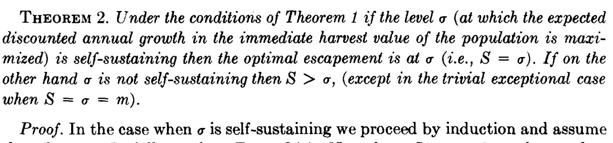
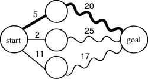
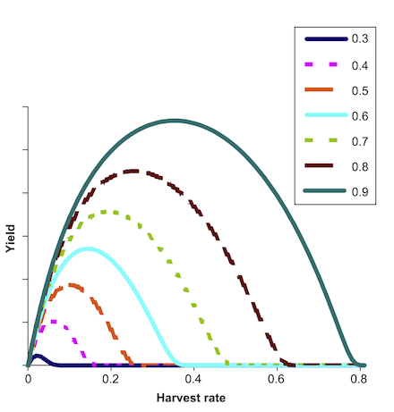

```{r setup, include=FALSE, message=FALSE}
options(htmltools.dir.version = FALSE)
knitr::opts_chunk$set(dev.args=list(bg="transparent"), 
                      echo = FALSE, message=FALSE, warning=FALSE,
                      fig.width=11, fig.height=6.5)

library(tidyverse)
library(ggthemes)

theme_set(
 theme_bw(base_size=26) + 
  theme(line = element_line(colour = "white", size = 1.5),
        rect = element_rect(fill = "transparent", colour = "white"),
        text = element_text(colour = "white"),
        axis.text = element_text(colour = "white"),
        axis.ticks = element_line(colour = "white", size = 1.5),
        panel.border = element_rect(colour = "white", size = 1.5),
        panel.background = element_rect(fill = "transparent"),
        plot.background = element_blank(), 
        legend.background = element_blank(), 
        legend.key = element_rect(fill = "transparent", colour = "transparent"), 
        strip.background = element_blank(),
        strip.text = element_text(colour = "white"),
        panel.grid = element_blank()))
        
```


background-image: url(img/noaa_fisheries.jpg)
background-position: center
background-size: 180%
class: center, bottom, inverse

> Managing fisheries is hard: it’s like managing a forest, in which the trees are invisible and keep moving around

--John Shepard, from unpublished lecture at Princeton University, ca 1978

<!--

> The real goal of fisheries management is to avoid finding out what the stock-recruitment relationship is. Once you have depleted the stock enough to know, it’s probably too late

--John Shepard, from an argument with David Cushing, ca 1980

-->

---

background-image: url(img/noaa_sunset.jpg)
background-position: center
background-size: 120%
class: center, bottom, inverse

# We've gotten much better at including uncertainties in our models

---

background-image: url(img/noaa_sunset.jpg)
background-position: center
background-size: 120%
class: center, bottom, inverse

# It is time to include uncertainties in our decisions

---

background-image: url(img/noaa_sunset.jpg)
background-position: center
background-size: 120%
class: center, bottom, inverse

# Decision Theory

--

### Fischer et al (2009): _Integrating resilience thinking and optimisation for conservation._

### Polasky et al (2011): _Decision-making under great uncertainty: environmental management in an era of global change._


---
background-image: url(img/bw.png)
background-position: center
background-size: 100%
class: center

.pull-left[

# Optimal Control 

]

.pull-right[
# <span style="color: white">Resilience Thinking</span>
]

---
background-image: url(img/noaa_school.jpg)
background-position: center
background-size: 120%
class: center, bottom, inverse

# Uncertainty about the Furture 

<!--
### Ecological Forecasting-->

---
background-image: url(img/noaa_school.jpg)
background-position: center
background-size: 120%
class: center, bottom, inverse


# Uncertainty about the Present

<!--
## Unknown Unknowns?
## Unknown Knowns
-->

---

background-image: url(img/noaa_trawler.jpg)
background-position: center
background-size: 100%
class: center, bottom, inverse

# Stock assessment uncertainty


---

background-image: url(img/noaa_fish.jpg)
background-position: center
background-size: 100%
class: center, top, inverse

# MSY: a sticky idea

```{r echo=FALSE, fig.width=8, fig.height=4.5}
r <- 1
K <- 100
H <- 0
logistic <- function(N) r * N * (1 - N / K) - H

data_frame(population_size = 0:100, 
           growth_rate = logistic(population_size)) %>%
  ggplot(aes(population_size, growth_rate)) + 
  geom_path(col="white", size=2) +
  geom_vline(aes(xintercept = K/2), lty = "dashed", col = "white", size = 1.5)
 
```

<!--two dashes treats prev slide as template; e.g. acts as hide/ sequential reveal mechanism -->

--

$$\frac{dN}{dt} = \underbrace{r N \left(1 - \frac{N}{K} \right)}_{f(N)} - H$$
$$H_{\text{MSY}} = f(N) = r K / 4, \phantom S B_{\text{MSY}} = K/2$$

---
class: center, bottom

# Stochastic Models: Reed 1979




---

## Constant Escapement vs MSY


```{r fig.width=11, fig.height=6.5}
plot_policies <- function(df){
  ggplot(df, aes(x = states, y = escapement, lty = method)) + 
    geom_line(lwd = 2) +
    coord_cartesian(xlim = c(0,1), ylim = c(0,0.8)) +
    ylab(bquote(paste("Escapement, ", B[MSY]))) + 
    xlab("Observed stock") + theme_tufte(26)
}
read_csv("policies.csv") -> df 

df %>%
  filter(method %in% c("det")) %>%
  plot_policies()
```

---
class: center, middle

## Sequential Decision problems: Dynamic Programming 




---
background-image: url(img/noaa_school.jpg)
background-position: center
background-size: 120%
class: center, middle, inverse

# Reed's legacy

-- 

## We can ignore troublesome dynamic programming ...

## ...and just stick with $S = B_{MSY}$ value from a model's deterministic skeleton

---

background-image: url(img/noaa_tuna.jpg)
background-position: center
background-size: 120%
class: center, bottom, inverse

## A long-standing paradox

> An important tacit assumption in Reed’s analysis, as in the other works referred
to above, is that the recruitment level X is known accurately prior to the harvest decision, [...] In the case of fishery resources, the stock level X is almost never known very accurately, owing to the difficulty of observing fish in their natural environment.

-- Clark & Kirkwood 1987


---

background-image: url(img/noaa_tuna.jpg)
background-position: center
background-size: 120%
class: center, bottom, inverse


> The above results appear to contradict the conventional wisdom of renewable resource management, under which high uncertainty would call for increased
caution in the setting of quotas.

-- Clark & Kirkwood 1986


---


background-image: url(img/noaa_reef.jpg)
background-position: bottom left
background-size: 150%
class: center, bottom, inverse


> It may seem counter-intuitive that a measurement error causes lower expected escapements
below the deterministic fishery closure threshold. 

-- Sethi et al (2005)

---

background-image: url(img/noaa_tuna_net.jpg)
background-position: center
background-size: 120%
class: center, middle, inverse

# The uncertainty paradox:


## _More_   uncertainty $\phantom = = \phantom =$ _Less_   precautionary?


---


# Pretty Good Yield (PGY)




---

background-image: url(img/noaa_tuna_net.jpg)
background-position: center
background-size: 120%
class: center, bottom, inverse

## Measurement uncertainty -> Non-Markovian

Previous work simply assumes the Markov property: prior history doesn't matter


---

background-image: url(img/noaa_tuna_net.jpg)
background-position: center
background-size: 120%
class: center, bottom, inverse

## A Tough Problem

> For reasons of tractability, we shall adopt the simplifying assumption that the escapement level S, is known exactly at the end of that period. (The mathematical difficulty
of the problem increases markedly if this assumption is
relaxed.)


---

background-image: url(img/self-driving-car.jpg)
class: center, inverse

# A Solution?

.pull-left.left[
.footnote[
CC-BY - flickr:jurvetson
]]

---

background-image: url(img/noaa_tuna_net.jpg)
background-position: center
background-size: 120%
class: left, top, inverse, bold

# POMDPs: Tracking the Belief State

We will need:

## Transition Matrix

--
## Utility Matrix

--
## Discount factor

--
## Observation Matrix

--
## (initial) prior belief

--

R package: <https://github.com/boettiger-lab/sarsop>


---

background-image: url(img/jetstream-cpus.jpg)
background-position: center
background-size: 100%
class: center, bottom, inverse

# XSEDE Jetstream Cloud

HPC for the rest of us

---

background-image: url(img/noaa_fisheries.jpg)
background-position: center
background-size: 180%
class: center, bottom, inverse


```{r fig.width=11, fig.height=6.5}
plot_policies <- function(df){
  ggplot(df, aes(x = states, y = escapement, lty = method)) + 
    geom_line(lwd = 2, col="white") +
    coord_cartesian(xlim = c(0,1), ylim = c(0,0.8)) +
    ylab(bquote(paste("Escapement, ", B[MSY]))) + 
    xlab("Observed stock")
}
read_csv("policies.csv") -> df 

df %>%
  filter(method %in% c("det")) %>%
  plot_policies()
```

## Deterministic Solution

---

background-image: url(img/noaa_fisheries.jpg)
background-position: center
background-size: 180%
class: center, bottom, inverse


```{r fig.width=11, fig.height=6.5}
df %>%
  filter(method %in% c("det", "pgy")) %>%
  plot_policies()
```

## Pretty Good Yield


---

background-image: url(img/noaa_fisheries.jpg)
background-position: center
background-size: 180%
class: center, bottom, inverse


```{r fig.width=11, fig.height=6.5}
df %>%
  filter(method %in% c("det", "low")) %>%
  plot_policies()
```

## Common sense prevails!


---

background-image: url(img/noaa_fisheries.jpg)
background-position: center
background-size: 180%
class: center, bottom, inverse


```{r fig.width=11, fig.height=6.5}
df %>%
  filter(method %in% c("det", "medium")) %>%
  plot_policies()
```

## (Prior) beliefs matter


---

background-image: url(img/noaa_fisheries.jpg)
background-position: center
background-size: 180%
class: center, bottom, inverse


```{r fig.width=11, fig.height=6.5}
df %>%
  filter(method %in% c("det", "low")) %>%
  plot_policies()
```

## (Prior) beliefs matter


---

background-image: url(img/noaa_fisheries.jpg)
background-position: center
background-size: 180%
class: center, bottom, inverse


```{r fig.width=11, fig.height=6.5}
df %>%
  filter(method %in% c("det", "high")) %>%
  plot_policies()
```

## (Prior) beliefs matter


---

background-image: url(img/noaa_fisheries.jpg)
background-position: center
background-size: 180%
class: center, bottom, inverse


```{r fig.width=12, fig.height=9}
  df %>% 
    filter(method %in% c("low", "medium", "high", "det")) %>% 
    mutate(prior = prior*3) %>%
    select(states, escapement, method, prior) %>%
    gather(panel, variable, -states, -method) %>%
    ggplot() + 
    geom_line(aes(x = states, y = variable, lty = method), lwd = 2, col="white") +
    facet_wrap(~panel, ncol=1) +
    coord_cartesian(xlim = c(0,1), ylim = c(0,0.8)) +
    xlab("Observed stock") + ylab("Escapement")
```

---

background-image: url(img/noaa_fisheries.jpg)
background-position: center
background-size: 180%
class: center, bottom, inverse

```{r fig.width=11, fig.height=6.5}
df %>%
  filter(method %in% c("det", "uniform")) %>%
  plot_policies()
```

## Paradoxical earlier results effectively ignored prior information

---


background-image: url(img/noaa_fisheries.jpg)
background-position: center
background-size: 180%
class: center, bottom, inverse

```{r fig.width=11, fig.height=6.5}
df %>%
  filter(method %in% c("det", "low", "pgy")) %>%
  plot_policies()
```

## "Pretty Good Yield" isn't always more conservative


---

background-image: url(img/noaa_mpas.jpg)
background-position: left
background-size: 180%
class: center, middle, inverse

# So how do these policies actually play out?


---
background-image: url(img/noaa_mpas.jpg)
background-position: center
background-size: 180%
class: center, middle, inverse

```{r}
static_sims <- read_csv("static_sims.csv")

static_sims %>% filter(method == "msy") %>%
  ggplot(aes(time, stock, lty = variable)) + 
  geom_line( lwd=2, col="white") 
```

# Maximum Sustainable Yield


---
background-image: url(img/noaa_mpas.jpg)
background-position: center
background-size: 180%
class: center, middle, inverse

```{r}
static_sims %>% filter(method == "msy") %>%
  ggplot(aes(time, stock, lty = variable)) + 
  geom_line( lwd=2, col="white") 
```

# Reed's MDP


---
background-image: url(img/noaa_mpas.jpg)
background-position: center
background-size: 180%
class: center, middle, inverse

```{r}
static_sims %>% filter(method == "pgy") %>%
  ggplot(aes(time, stock, lty = variable)) + 
  geom_line( lwd=2, col="white") 
```

# Pretty Good Yield

---
background-image: url(img/noaa_mpas.jpg)
background-position: center
background-size: 180%
class: center, middle, inverse

```{r}
read_csv("pomdp_sim.csv")  %>%
  ggplot(aes(time, stock, lty = variable)) + 
  geom_line( lwd=2, col="white") 
```

# POMDP


---
class: inverse

# Conclusions


--
- Predictions are not enough: Decisions need their own theory

--
- Precaution cannot be tacked on

--
- Beliefs / prior experience matters

--
- Much to learn from other fields

---

# Acknowledgements 

.pull-left[


Milad Memarzadeh


ESPM Dept (startup)
]

.pull-right[


Image credits


Cloud Computing

]

---

# Appendix: Age structure

--

- Larval only density dependence -> MSY solution, harvest only on most valuable age class (Reed 1980, Getz 1980)

--

- Age+stage structured may not be an MSY (cyclical escapement, still an average $B_{\text{MSY}}$)

--

- Stochastic age-structured models: also support either larger or smaller harvest than the deterministic equivalent, but still at a constant escapement policy

